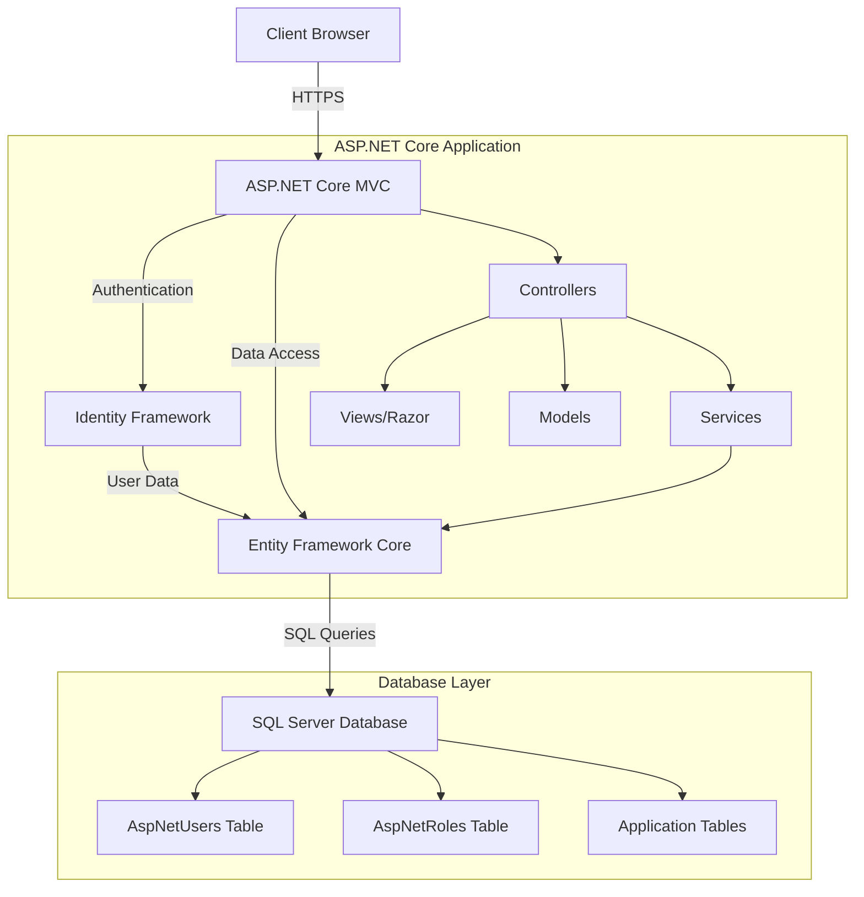

# AEGIS Insurance Application - Architecture Plan

## Project Overview
ASP.NET Core MVC application for AEGIS Insurance & Reinsurance Brokers W.L.L with modern authentication system and premium UI/UX design.

## Technology Stack

### Backend
- **Framework**: ASP.NET Core 8.0 MVC
- **Database**: SQL Server (Remote Server: 87.252.104.168)
- **ORM**: Entity Framework Core 8.0
- **Authentication**: ASP.NET Core Identity (Simple username/password)

### Frontend
- **HTML5** with Razor Views
- **CSS3** with modern effects (Glassmorphism, gradients, shadows)
- **JavaScript** for client-side validation and animations
- **Bootstrap 5** for responsive grid system

## Color Scheme (From AEGIS Logo)

### Primary Colors
- **Teal Primary**: `#00A6A6` - Main brand color
- **Teal Light**: `#4DB8B8` - Hover states, accents
- **Teal Dark**: `#008B8B` - Buttons, headers

### Secondary Colors
- **Navy Dark**: `#0D4D4D` - Text, backgrounds
- **Navy Medium**: `#1A5C5C` - Secondary elements
- **Cyan Light**: `#7DD5D5` - Highlights, borders

### Neutral Colors
- **White**: `#FFFFFF` - Card backgrounds
- **Light Gray**: `#F5F5F5` - Page backgrounds
- **Dark Gray**: `#333333` - Body text

## Application Architecture



## Project Structure

```
BIMS/
├── Controllers/
│   ├── AccountController.cs      # Login, Register, Logout
│   ├── HomeController.cs          # Dashboard, Home
│   └── ErrorController.cs         # Error handling
├── Models/
│   ├── ApplicationUser.cs         # Extended Identity user
│   ├── LoginViewModel.cs          # Login form model
│   ├── RegisterViewModel.cs       # Registration form model
│   └── ErrorViewModel.cs          # Error display
├── Data/
│   └── ApplicationDbContext.cs    # EF Core context
├── Views/
│   ├── Account/
│   │   ├── Login.cshtml          # Modern glossy login page
│   │   └── Register.cshtml       # Registration page
│   ├── Home/
│   │   ├── Dashboard.cshtml      # Protected dashboard
│   │   └── Index.cshtml          # Public home
│   └── Shared/
│       ├── _Layout.cshtml        # Master layout
│       └── _LoginLayout.cshtml   # Login-specific layout
├── wwwroot/
│   ├── css/
│   │   ├── site.css              # Global styles
│   │   └── login.css             # Login page styles
│   ├── js/
│   │   └── login.js              # Login interactions
│   ├── images/
│   │   └── aegis-logo.png        # AEGIS logo
│   └── lib/                      # Client libraries
├── Migrations/                    # EF Core migrations
├── Program.cs                     # Application entry point
├── appsettings.json              # Configuration
└── BIMS.csproj                   # Project file
```

## Database Schema

### Identity Tables (Auto-created)
- **AspNetUsers** - User accounts
- **AspNetRoles** - User roles
- **AspNetUserRoles** - User-role mapping
- **AspNetUserClaims** - User claims
- **AspNetUserLogins** - External logins
- **AspNetUserTokens** - Authentication tokens
- **AspNetRoleClaims** - Role claims

### Custom User Model
```csharp
public class ApplicationUser : IdentityUser
{
    public string? FullName { get; set; }
    public DateTime CreatedDate { get; set; }
    public DateTime? LastLoginDate { get; set; }
    public bool IsActive { get; set; }
}
```

## Login Page Design Concept

### Visual Design
- **Glassmorphism Effect**: Frosted glass background with blur
- **Gradient Background**: Teal gradient from light to dark
- **Floating Card**: Centered login form with shadow
- **Logo Integration**: AEGIS logo prominently displayed
- **Smooth Animations**: Fade-in effects, hover states

### Layout Structure
```
┌─────────────────────────────────────┐
│  Gradient Background (Teal Shades)  │
│  ┌─────────────────────────────┐   │
│  │   [AEGIS Logo]              │   │
│  │                             │   │
│  │   Welcome Back              │   │
│  │   Sign in to continue       │   │
│  │                             │   │
│  │   [Username Input]          │   │
│  │   [Password Input]          │   │
│  │                             │   │
│  │   [Remember Me] [Forgot?]   │   │
│  │                             │   │
│  │   [Login Button]            │   │
│  │                             │   │
│  │   Don't have an account?    │   │
│  │   Register here             │   │
│  └─────────────────────────────┘   │
└─────────────────────────────────────┘
```

## Key Features

### 1. Authentication System
- ✅ User registration with validation
- ✅ Secure password hashing (Identity default)
- ✅ Login with session management
- ✅ Logout functionality
- ✅ Remember me option
- ✅ Protected routes (Authorize attribute)

### 2. Modern UI/UX
- ✅ Glassmorphism effects
- ✅ Smooth transitions and animations
- ✅ Responsive design (mobile-first)
- ✅ Form validation feedback
- ✅ Loading states
- ✅ Error messages with styling

### 3. Security Features
- ✅ Password encryption (Identity default)
- ✅ CSRF protection (ASP.NET Core default)
- ✅ XSS prevention (Razor encoding)
- ✅ SQL injection prevention (EF Core)
- ✅ HTTPS enforcement
- ✅ Secure cookie settings

## Implementation Steps

### Phase 1: Project Setup
1. Create ASP.NET Core MVC project
2. Install required NuGet packages
3. Configure connection string
4. Set up project structure

### Phase 2: Database Configuration
1. Create ApplicationDbContext
2. Define ApplicationUser model
3. Configure Identity services
4. Create initial migration
5. Update database

### Phase 3: Authentication Logic
1. Create AccountController
2. Implement Login action and view model
3. Implement Register action and view model
4. Implement Logout action
5. Add validation attributes

### Phase 4: UI Implementation
1. Create custom login layout
2. Design login page with AEGIS branding
3. Implement glassmorphism CSS effects
4. Add JavaScript for form validation
5. Create responsive breakpoints

### Phase 5: Dashboard Setup
1. Create protected HomeController
2. Design empty dashboard layout
3. Add navigation menu
4. Implement user profile display

### Phase 6: Testing & Refinement
1. Test registration flow
2. Test login/logout flow
3. Test authorization on protected routes
4. Verify responsive design
5. Cross-browser testing

## Required NuGet Packages

```xml
<!-- Core Framework -->
<PackageReference Include="Microsoft.AspNetCore.Mvc" Version="8.0.*" />

<!-- Entity Framework Core -->
<PackageReference Include="Microsoft.EntityFrameworkCore" Version="8.0.*" />
<PackageReference Include="Microsoft.EntityFrameworkCore.SqlServer" Version="8.0.*" />
<PackageReference Include="Microsoft.EntityFrameworkCore.Tools" Version="8.0.*" />

<!-- Identity Framework -->
<PackageReference Include="Microsoft.AspNetCore.Identity.EntityFrameworkCore" Version="8.0.*" />
<PackageReference Include="Microsoft.AspNetCore.Identity.UI" Version="8.0.*" />
```

## Configuration Settings

### appsettings.json
```json
{
  "ConnectionStrings": {
    "DefaultConnection": "Server=87.252.104.168;Database=IBMS;User Id=sa;Password=*26malar19baby;Encrypt=false;MultipleActiveResultSets=true;"
  },
  "Logging": {
    "LogLevel": {
      "Default": "Information",
      "Microsoft.AspNetCore": "Warning"
    }
  },
  "AllowedHosts": "*"
}
```

## Security Considerations

1. **Password Policy**: Minimum 6 characters (configurable)
2. **Account Lockout**: Disabled for simple auth (can enable)
3. **HTTPS**: Should be enforced in production
4. **Connection String**: Should be in user secrets for production
5. **CORS**: Configure if API endpoints are added

## Future Enhancements (Post-MVP)

- Email verification for registration
- Password recovery/reset functionality
- Two-factor authentication (2FA)
- Social login (Google, Microsoft)
- User profile management
- Role-based authorization
- Activity logging
- Session timeout management
- Remember me token expiration

## Responsive Breakpoints

- **Mobile**: < 576px (Single column, full-width form)
- **Tablet**: 576px - 768px (Centered form, 80% width)
- **Desktop**: 768px - 1200px (Centered form, 500px width)
- **Large**: > 1200px (Centered form, 500px width)

## Color Usage Guide

### Login Page
- **Background**: Gradient from #7DD5D5 to #00A6A6
- **Card**: White with glassmorphism effect
- **Primary Button**: #00A6A6 (hover: #008B8B)
- **Input Borders**: #4DB8B8
- **Text**: #0D4D4D
- **Links**: #00A6A6

### Dashboard
- **Header**: #0D4D4D
- **Sidebar**: #1A5C5C
- **Content Area**: #F5F5F5
- **Cards**: White with shadow
- **Accents**: #00A6A6

## Browser Support

- Chrome (latest 2 versions)
- Firefox (latest 2 versions)
- Safari (latest 2 versions)
- Edge (latest 2 versions)
- Mobile browsers (iOS Safari, Chrome Mobile)

---

## Next Steps

Once this plan is approved, we will switch to **Code Mode** to implement:
1. Project creation and setup
2. Database configuration and migration
3. Authentication controllers and views
4. Modern UI/UX implementation
5. Testing and deployment preparation

The implementation will follow the todo list created, ensuring each component is built and tested incrementally.