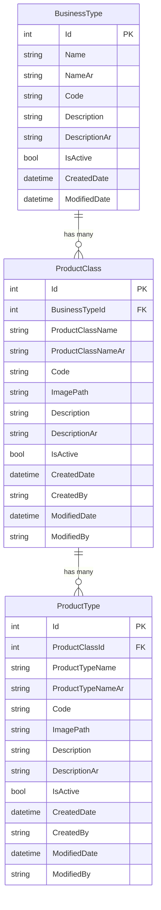

# Insurance Management Module - Architecture Document

## Overview
The Insurance Management module handles insurance product classification and types, providing a hierarchical structure for insurance offerings.

## Database Design

### Entity Relationship Diagram



### Relationships
1. **BusinessType → ProductClass**: One-to-Many
   - One Business Type can have many Product Classes
   - Each Product Class belongs to one Business Type

2. **ProductClass → ProductType**: One-to-Many
   - One Product Class can have many Product Types
   - Each Product Type belongs to one Product Class

---

## Data Models

### 1. ProductClass Model
**File**: `Models/ProductClass.cs`

```csharp
public class ProductClass
{
    public int Id { get; set; }
    
    [Required]
    [Display(Name = "Business Type")]
    public int BusinessTypeId { get; set; }
    
    [Required]
    [StringLength(100)]
    [Display(Name = "Product Class Name (English)")]
    public string ProductClassName { get; set; }
    
    [StringLength(100)]
    [Display(Name = "اسم فئة المنتج (عربي)")]
    public string? ProductClassNameAr { get; set; }
    
    [StringLength(50)]
    [Display(Name = "Code")]
    public string? Code { get; set; }
    
    [StringLength(500)]
    [Display(Name = "Image Path")]
    public string? ImagePath { get; set; }
    
    [StringLength(1000)]
    [Display(Name = "Description (English)")]
    public string? Description { get; set; }
    
    [StringLength(1000)]
    [Display(Name = "الوصف (عربي)")]
    public string? DescriptionAr { get; set; }
    
    [Display(Name = "Active")]
    public bool IsActive { get; set; } = true;
    
    public DateTime CreatedDate { get; set; }
    public string? CreatedBy { get; set; }
    public DateTime? ModifiedDate { get; set; }
    public string? ModifiedBy { get; set; }
    
    // Navigation properties
    public virtual BusinessType? BusinessType { get; set; }
    public virtual ICollection<ProductType>? ProductTypes { get; set; }
}
```

### 2. ProductType Model
**File**: `Models/ProductType.cs`

```csharp
public class ProductType
{
    public int Id { get; set; }
    
    [Required]
    [Display(Name = "Product Class")]
    public int ProductClassId { get; set; }
    
    [Required]
    [StringLength(100)]
    [Display(Name = "Product Type Name (English)")]
    public string ProductTypeName { get; set; }
    
    [StringLength(100)]
    [Display(Name = "اسم نوع المنتج (عربي)")]
    public string? ProductTypeNameAr { get; set; }
    
    [StringLength(50)]
    [Display(Name = "Code")]
    public string? Code { get; set; }
    
    [StringLength(500)]
    [Display(Name = "Image Path")]
    public string? ImagePath { get; set; }
    
    [StringLength(1000)]
    [Display(Name = "Description (English)")]
    public string? Description { get; set; }
    
    [StringLength(1000)]
    [Display(Name = "الوصف (عربي)")]
    public string? DescriptionAr { get; set; }
    
    [Display(Name = "Active")]
    public bool IsActive { get; set; } = true;
    
    public DateTime CreatedDate { get; set; }
    public string? CreatedBy { get; set; }
    public DateTime? ModifiedDate { get; set; }
    public string? ModifiedBy { get; set; }
    
    // Navigation properties
    public virtual ProductClass? ProductClass { get; set; }
}
```

### 3. Update BusinessType Model
Add navigation property:
```csharp
public virtual ICollection<ProductClass>? ProductClasses { get; set; }
```

---

## Controller Architecture

### InsuranceController
**File**: `Controllers/InsuranceController.cs`

**Methods**:

#### Product Class Operations
- `ProductClasses()` - GET: List all product classes
- `CreateProductClass()` - GET: Show create form
- `CreateProductClass(ProductClass, IFormFile)` - POST: Create new product class
- `EditProductClass(int? id)` - GET: Show edit form
- `EditProductClass(int, ProductClass, IFormFile)` - POST: Update product class
- `DeleteProductClass(int? id)` - GET: Show delete confirmation
- `DeleteProductClassConfirmed(int)` - POST: Delete product class

#### Product Type Operations
- `ProductTypes()` - GET: List all product types
- `CreateProductType()` - GET: Show create form
- `CreateProductType(ProductType, IFormFile)` - POST: Create new product type
- `EditProductType(int? id)` - GET: Show edit form
- `EditProductType(int, ProductType, IFormFile)` - POST: Update product type
- `DeleteProductType(int? id)` - GET: Show delete confirmation
- `DeleteProductTypeConfirmed(int)` - POST: Delete product type

#### API Endpoints
- `GetProductClassesByBusinessType(int)` - GET: For cascading dropdown
- `GetProductTypesByClass(int)` - GET: For cascading dropdown

---

## Image Upload Strategy

### Upload Configuration
- **Upload Path**: `wwwroot/uploads/insurance/`
  - `product-classes/` - Product class images
  - `product-types/` - Product type images
- **Allowed Extensions**: `.jpg`, `.jpeg`, `.png`, `.gif`, `.webp`
- **Max File Size**: 2 MB
- **Image Validation**: Check dimensions, file type, size
- **Naming Convention**: `{GUID}_{original-filename}`

### Upload Process
1. Validate file (type, size)
2. Generate unique filename
3. Save to appropriate directory
4. Store relative path in database
5. Display image in forms/lists

### Image Display
- **In Lists**: Thumbnail (50x50px)
- **In Forms**: Preview (150x150px)
- **Default Image**: Placeholder if no image uploaded

---

## View Architecture

### Product Class Views

#### 1. ProductClasses.cshtml (List View)
**Features**:
- Data table with columns:
  - Image (thumbnail)
  - Code
  - Product Class Name
  - Business Type
  - Description
  - Active Status
  - Actions (Edit, Delete)
- Search/filter functionality
- Create button
- Bilingual display

#### 2. CreateProductClass.cshtml
**Form Fields**:
- Business Type (dropdown)
- Product Class Name (English) - required
- Product Class Name (Arabic)
- Code
- Image Upload (with preview)
- Description (English)
- Description (Arabic) 
- Active checkbox

#### 3. EditProductClass.cshtml
**Features**:
- Same as Create form
- Shows current image with option to change
- Delete image option
- Pre-filled values

#### 4. DeleteProductClass.cshtml
**Features**:
- Shows all details
- Warning about dependent Product Types
- Confirmation required

### Product Type Views

#### 1. ProductTypes.cshtml (List View)
**Features**:
- Data table with columns:
  - Image (thumbnail)
  - Code
  - Product Type Name
  - Product Class
  - Business Type
  - Description
  - Active Status
  - Actions (Edit, Delete)
- Filter by Product Class
- Search functionality
- Create button

#### 2. CreateProductType.cshtml
**Form Fields**:
- Product Class (dropdown - cascading from Business Type)
- Product Type Name (English) - required
- Product Type Name (Arabic)
- Code
- Image Upload (with preview)
- Description (English)
- Description (Arabic)
- Active checkbox

#### 3. EditProductType.cshtml
**Features**:
- Same as Create form
- Shows current image
- Delete/change image options
- Pre-filled values

#### 4. DeleteProductType.cshtml
**Features**:
- Shows all details including image
- Confirmation required
- Warning about cascading effects

---

## Navigation Menu Structure

### Top-Level Menu
```
Insurance Management 🛡️
├── Product Classes
└── Product Types
```

### Menu Implementation
**File**: `Views/Shared/_Layout.cshtml`

```html
<div class="dropdown">
    <button class="dropdown-toggle">
        <span>🛡️</span> Insurance Management <span class="arrow">▼</span>
    </button>
    <div class="dropdown-menu">
        <a asp-controller="Insurance" asp-action="ProductClasses" class="dropdown-item">
            <span>📦</span> Product Classes
        </a>
        <a asp-controller="Insurance" asp-action="ProductTypes" class="dropdown-item">
            <span>🏷️</span> Product Types
        </a>
    </div>
</div>
```

---

## Database Context Updates

### ApplicationDbContext.cs
Add DbSets:
```csharp
public DbSet<ProductClass> ProductClasses { get; set; }
public DbSet<ProductType> ProductTypes { get; set; }
```

Configure relationships in `OnModelCreating`:
```csharp
// ProductClass relationships
modelBuilder.Entity<ProductClass>()
    .HasOne(pc => pc.BusinessType)
    .WithMany(bt => bt.ProductClasses)
    .HasForeignKey(pc => pc.BusinessTypeId)
    .OnDelete(DeleteBehavior.Restrict);

// ProductType relationships
modelBuilder.Entity<ProductType>()
    .HasOne(pt => pt.ProductClass)
    .WithMany(pc => pc.ProductTypes)
    .HasForeignKey(pt => pt.ProductClassId)
    .OnDelete(DeleteBehavior.Restrict);
```

---

## Business Logic

### ProductClass Business Rules
1. **Creation**:
   - Business Type must exist and be active
   - Product Class Name must be unique per Business Type
   - Code must be unique (if provided)
   - Image is optional

2. **Update**:
   - Cannot change Business Type if Product Types exist
   - Can upload new image (old one deleted)
   - All validations apply

3. **Deletion**:
   - Cannot delete if Product Types exist
   - Must delete/reassign Product Types first
   - Delete associated image file from server

### ProductType Business Rules
1. **Creation**:
   - Product Class must exist and be active
   - Product Type Name must be unique per Product Class
   - Code must be unique (if provided)
   - Image is optional

2. **Update**:
   - Cannot change Product Class if linked to policies (future)
   - Can upload new image (old one deleted)
   - All validations apply

3. **Deletion**:
   - Check for dependencies (policies, etc.)
   - Delete associated image file
   - Soft delete option (mark inactive)

---

## Image Management

### Upload Flow
```
User Selects Image → Validate → Generate Filename → 
Save to Server → Store Path in DB → Display Preview
```

### Image Utilities Class
**File**: `Utilities/ImageHelper.cs`

```csharp
public static class ImageHelper
{
    public static async Task<string?> SaveImageAsync(
        IFormFile file, 
        string uploadPath);
    
    public static bool DeleteImage(string? imagePath);
    
    public static bool IsValidImage(IFormFile file);
    
    public static string GetImageUrl(string? imagePath);
}
```

---

## Validation Rules

### ProductClass Validation
| Field | Rule | Message |
|-------|------|---------|
| ProductClassName | Required, Max 100 chars | "Product Class Name is required" |
| BusinessTypeId | Required, Must exist | "Please select a valid Business Type" |
| Code | Unique, Max 50 chars | "Code already exists" |
| Image | Max 2MB, Valid format | "Invalid image file" |
| Description | Max 1000 chars | "Description too long" |

### ProductType Validation
| Field | Rule | Message |
|-------|------|---------|
| ProductTypeName | Required, Max 100 chars | "Product Type Name is required" |
| ProductClassId | Required, Must exist | "Please select a valid Product Class" |
| Code | Unique, Max 50 chars | "Code already exists" |
| Image | Max 2MB, Valid format | "Invalid image file" |
| Description | Max 1000 chars | "Description too long" |

---

## UI/UX Design

### List View Features
- **Search**: By name, code
- **Filter**: By Business Type, Product Class, Active status
- **Sort**: By name, created date
- **Pagination**: 20 items per page
- **Actions**: Edit, Delete, View details
- **Bulk Actions**: Activate/Deactivate selected

### Form Features
- **Image Upload**:
  - Drag and drop support
  - Click to select
  - Image preview
  - Delete current image option
- **Bilingual Input**:
  - Side-by-side English/Arabic fields
  - RTL support for Arabic
- **Validation**:
  - Real-time client-side validation
  - Server-side validation
  - Clear error messages

### Cascading Dropdowns (Create/Edit Product Type)
1. Select Business Type (optional filter)
2. Product Class dropdown filters by Business Type
3. If Business Type changes, reset Product Class

---

## File Structure

```
Controllers/
  └── InsuranceController.cs        (Primary controller)

Models/
  ├── ProductClass.cs                (Product Class entity)
  └── ProductType.cs                 (Product Type entity)

Views/
  └── Insurance/
      ├── ProductClasses.cshtml      (List view)
      ├── CreateProductClass.cshtml  (Create form)
      ├── EditProductClass.cshtml    (Edit form)
      ├── DeleteProductClass.cshtml  (Delete confirmation)
      ├── ProductTypes.cshtml        (List view)
      ├── CreateProductType.cshtml   (Create form)
      ├── EditProductType.cshtml     (Edit form)
      └── DeleteProductType.cshtml   (Delete confirmation)

wwwroot/
  ├── images/
  │   └── placeholders/
  │       └── no-image.png           (Default placeholder)
  └── uploads/
      └── insurance/
          ├── product-classes/       (Product class images)
          └── product-types/         (Product type images)

Utilities/
  └── ImageHelper.cs                 (Image upload helpers)

Migrations/
  └── xxxxxx_AddInsuranceTables.cs  (Database migration)
```

---

## Implementation Phases

### Phase 1: Database & Models ✅
- [x] Create ProductClass model
- [x] Create ProductType model
- [x] Update BusinessType model
- [x] Create database migration
- [x] Update ApplicationDbContext

### Phase 2: Product Class CRUD
- [ ] Create InsuranceController
- [ ] Add ProductClass CRUD methods
- [ ] Create ProductClass views
- [ ] Add image upload for ProductClass
- [ ] Test ProductClass operations

### Phase 3: Product Type CRUD  
- [ ] Add ProductType CRUD methods
- [ ] Create ProductType views
- [ ] Add image upload for ProductType
- [ ] Add cascading dropdown logic
- [ ] Test ProductType operations

### Phase 4: Navigation & Integration
- [ ] Update navigation menu
- [ ] Add Insurance menu item
- [ ] Test navigation flow
- [ ] Verify permissions

### Phase 5: Testing & Documentation
- [ ] Unit testing
- [ ] Integration testing
- [ ] User acceptance testing
- [ ] Create user documentation

---

## Security Considerations

### Authorization
- All actions require authentication (`[Authorize]`)
- Role-based access (future: Admin only for delete)
- Audit trail (CreatedBy, ModifiedBy)

### File Upload Security
- Validate file extensions
- Check file size limits
- Scan for malicious content
- Store outside web root (or with restricted access)
- Generate unique filenames

### Data Validation
- Server-side validation (primary)
- Client-side validation (enhanced UX)
- SQL injection prevention (EF Core)
- XSS prevention (Razor encoding)

---

## Performance Optimization

### Database
- Create indexes on:
  - ProductClass.BusinessTypeId
  - ProductClass.Code
  - ProductType.ProductClassId
  - ProductType.Code
- Use eager loading for related entities
- Implement caching for frequently accessed data

### Image Loading
- Lazy loading for list views
- Thumbnail generation
- CDN integration (future)
- Compression for uploaded images

---

## Localization Strategy

### Bilingual Support
- **English**: Primary language
- **Arabic**: Secondary language with RTL support
- **Session-based**: Language stored in session
- **Fallback**: Display English if Arabic not available

### Localizable Elements
- Menu labels
- Form labels
- Button text
- Validation messages
- Success/error messages
- Table headers

---

## API Endpoints

### ProductClass APIs
| Method | Endpoint | Purpose |
|--------|----------|---------|
| GET | `/Insurance/ProductClasses` | List all product classes |
| GET | `/Insurance/CreateProductClass` | Show create form |
| POST | `/Insurance/CreateProductClass` | Create product class |
| GET | `/Insurance/EditProductClass/{id}` | Show edit form |
| POST | `/Insurance/EditProductClass/{id}` | Update product class |
| GET | `/Insurance/DeleteProductClass/{id}` | Show delete confirmation |
| POST | `/Insurance/DeleteProductClass/{id}` | Delete product class |
| GET | `/Insurance/GetProductClassesByBusinessType/{id}` | Cascading dropdown API |

### ProductType APIs
| Method | Endpoint | Purpose |
|--------|----------|---------|
| GET | `/Insurance/ProductTypes` | List all product types |
| GET | `/Insurance/CreateProductType` | Show create form |
| POST | `/Insurance/CreateProductType` | Create product type |
| GET | `/Insurance/EditProductType/{id}` | Show edit form |
| POST | `/Insurance/EditProductType/{id}` | Update product type |
| GET | `/Insurance/DeleteProductType/{id}` | Show delete confirmation |
| POST | `/Insurance/DeleteProductType/{id}` | Delete product type |
| GET | `/Insurance/GetProductTypesByClass/{id}` | Cascading dropdown API |

---

## Testing Strategy

### Unit Tests
- Model validation tests
- Business logic tests
- Image upload tests
- Cascading dropdown tests

### Integration Tests
- Full CRUD operations
- Relationship integrity
- Image file operations
- Navigation flow

### UI Tests
- Form submission
- Image preview
- Cascading dropdowns
- Error handling
- Bilingual display

---

## Future Enhancements

### Phase 2 Features
- [ ] Bulk image upload
- [ ] Image gallery view
- [ ] Image optimization/compression
- [ ] Image cropping tool
- [ ] Export to Excel
- [ ] Import from Excel

### Phase 3 Features
- [ ] Product hierarchy visualization
- [ ] Product catalog view
- [ ] Product comparison
- [ ] Advanced filtering
- [ ] Product tags/categories

---

## Conclusion

This architecture provides a solid foundation for the Insurance Management module with:
- Clear entity relationships
- Comprehensive CRUD operations
- Secure image upload
- Bilingual support
- Professional UI/UX
- Scalability for future enhancements

---

*Architecture Version: 1.0*
*Date: 2025-11-12*
*Status: Ready for Implementation*