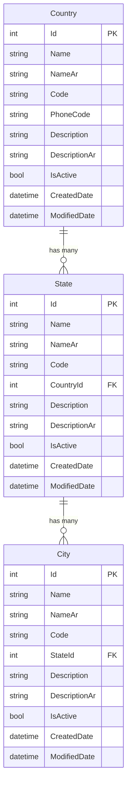

# Location Masters Architecture Plan
## Country, State, and City CRUD Operations

### Overview
This document outlines the architecture and implementation plan for adding Country, State, and City master data management to the BIMS (AEGIS Insurance Broker Management System). These entities will follow the existing patterns established in the project with bilingual support (English/Arabic) and hierarchical relationships.

---

## 1. Data Model Architecture

### 1.1 Country Model
```csharp
public class Country
{
    public int Id { get; set; }
    
    [Required]
    [StringLength(100)]
    public string Name { get; set; }
    
    [StringLength(100)]
    public string? NameAr { get; set; }
    
    [StringLength(10)]
    public string? Code { get; set; }  // ISO country code (e.g., SA, US)
    
    [StringLength(10)]
    public string? PhoneCode { get; set; }  // International dialing code (e.g., +966)
    
    [StringLength(500)]
    public string? Description { get; set; }
    
    [StringLength(500)]
    public string? DescriptionAr { get; set; }
    
    public bool IsActive { get; set; } = true;
    public DateTime CreatedDate { get; set; }
    public DateTime? ModifiedDate { get; set; }
    
    // Navigation property
    public virtual ICollection<State>? States { get; set; }
}
```

### 1.2 State Model
```csharp
public class State
{
    public int Id { get; set; }
    
    [Required]
    [StringLength(100)]
    public string Name { get; set; }
    
    [StringLength(100)]
    public string? NameAr { get; set; }
    
    [StringLength(50)]
    public string? Code { get; set; }
    
    [Required]
    public int CountryId { get; set; }
    
    [StringLength(500)]
    public string? Description { get; set; }
    
    [StringLength(500)]
    public string? DescriptionAr { get; set; }
    
    public bool IsActive { get; set; } = true;
    public DateTime CreatedDate { get; set; }
    public DateTime? ModifiedDate { get; set; }
    
    // Navigation properties
    public virtual Country? Country { get; set; }
    public virtual ICollection<City>? Cities { get; set; }
}
```

### 1.3 City Model
```csharp
public class City
{
    public int Id { get; set; }
    
    [Required]
    [StringLength(100)]
    public string Name { get; set; }
    
    [StringLength(100)]
    public string? NameAr { get; set; }
    
    [StringLength(50)]
    public string? Code { get; set; }
    
    [Required]
    public int StateId { get; set; }
    
    [StringLength(500)]
    public string? Description { get; set; }
    
    [StringLength(500)]
    public string? DescriptionAr { get; set; }
    
    public bool IsActive { get; set; } = true;
    public DateTime CreatedDate { get; set; }
    public DateTime? ModifiedDate { get; set; }
    
    // Navigation property
    public virtual State? State { get; set; }
}
```

---

## 2. Database Relationships

### Entity Relationship Diagram



### Relationship Configuration
- **Country → State**: One-to-Many (DeleteBehavior.Restrict)
- **State → City**: One-to-Many (DeleteBehavior.Restrict)

---

## 3. Controller Architecture

### MastersController Extensions

The [`MastersController`](Controllers/MastersController.cs) will be extended with three new sections:

#### 3.1 Country CRUD Operations
- `Countries()` - List all countries
- `CreateCountry()` - GET/POST for creating new country
- `EditCountry(id)` - GET/POST for editing country
- `DeleteCountry(id)` - GET/POST for deleting country
- `CountryExists(id)` - Helper method

#### 3.2 State CRUD Operations
- `States()` - List all states with country information
- `CreateState()` - GET/POST for creating new state (with country dropdown)
- `EditState(id)` - GET/POST for editing state
- `DeleteState(id)` - GET/POST for deleting state
- `StateExists(id)` - Helper method

#### 3.3 City CRUD Operations
- `Cities()` - List all cities with state/country information
- `CreateCity()` - GET/POST for creating new city (with state dropdown)
- `EditCity(id)` - GET/POST for editing city
- `DeleteCity(id)` - GET/POST for deleting city
- `CityExists(id)` - Helper method

---

## 4. View Architecture

### 4.1 Country Views
All views will be created in `Views/Masters/` directory:

1. **Countries.cshtml** - List view with table
   - Columns: Name, Code, Phone Code, Status, Created Date, Actions
   - Bilingual support for all text
   - Edit and Delete action buttons

2. **CreateCountry.cshtml** - Form for creating country
   - Fields: Name (EN), Name (AR), Code, Phone Code, Description (EN), Description (AR), IsActive
   - Validation messages
   - Cancel and Save buttons

3. **EditCountry.cshtml** - Form for editing country
   - Same fields as Create
   - Pre-populated with existing data

4. **DeleteCountry.cshtml** - Confirmation view
   - Display country details
   - Confirm/Cancel buttons

### 4.2 State Views

1. **States.cshtml** - List view with table
   - Columns: Name, Country, Code, Status, Created Date, Actions
   - Filter by country (optional enhancement)
   - Bilingual support

2. **CreateState.cshtml** - Form for creating state
   - Fields: Name (EN), Name (AR), Country (dropdown), Code, Description (EN), Description (AR), IsActive
   - Country dropdown populated from active countries

3. **EditState.cshtml** - Form for editing state
   - Same fields as Create
   - Pre-populated data

4. **DeleteState.cshtml** - Confirmation view
   - Display state and related country
   - Confirm/Cancel buttons

### 4.3 City Views

1. **Cities.cshtml** - List view with table
   - Columns: Name, State, Country, Code, Status, Created Date, Actions
   - Filter by state/country (optional enhancement)
   - Bilingual support

2. **CreateCity.cshtml** - Form for creating city
   - Fields: Name (EN), Name (AR), State (dropdown), Code, Description (EN), Description (AR), IsActive
   - State dropdown populated from active states
   - Optional: Cascading dropdown (Country → State)

3. **EditCity.cshtml** - Form for editing city
   - Same fields as Create
   - Pre-populated data

4. **DeleteCity.cshtml** - Confirmation view
   - Display city and related state/country
   - Confirm/Cancel buttons

---

## 5. Navigation Menu Updates

### Menu Structure in _Layout.cshtml

The Masters dropdown menu will be updated to include:

```
Masters (⚙️ الأساسيات)
├── Customer Types (👥 أنواع العملاء)
├── Document Types (📄 أنواع المستندات)
├── Business Types (💼 أنواع الأعمال)
├── [DIVIDER]
├── Location Management (📍 إدارة المواقع) [NEW SECTION HEADER]
│   ├── Countries (🌍 الدول)
│   ├── States (🗺️ الولايات)
│   └── Cities (🏙️ المدن)
├── [DIVIDER]
├── Finance (💰 المالية)
│   └── Banks (🏦 البنوك)
└── Vehicle Management (🚗 إدارة المركبات)
    ├── Vehicle Makes (🏭 صناع المركبات)
    ├── Vehicle Models (🚙 موديلات المركبات)
    ├── Vehicle Years (📅 سنوات الإنتاج)
    └── Engine Capacity (⚙️ سعة المحرك)
```

---

## 6. Implementation Workflow

### Phase 1: Data Layer
1. Create [`Country.cs`](Models/Country.cs) model
2. Create [`State.cs`](Models/State.cs) model
3. Create [`City.cs`](Models/City.cs) model
4. Update [`ApplicationDbContext.cs`](Data/ApplicationDbContext.cs)
5. Create and apply migration

### Phase 2: Controller Layer
1. Add Country CRUD methods to [`MastersController.cs`](Controllers/MastersController.cs)
2. Add State CRUD methods to [`MastersController.cs`](Controllers/MastersController.cs)
3. Add City CRUD methods to [`MastersController.cs`](Controllers/MastersController.cs)

### Phase 3: View Layer
1. Create all Country views (4 files)
2. Create all State views (4 files)
3. Create all City views (4 files)

### Phase 4: Navigation
1. Update [`_Layout.cshtml`](Views/Shared/_Layout.cshtml) with new menu items

### Phase 5: Testing
1. Test Country CRUD operations
2. Test State CRUD operations with Country relationship
3. Test City CRUD operations with State relationship
4. Test bilingual functionality
5. Test cascading deletes are prevented

---

## 7. Key Features

### Bilingual Support
- All entities support English and Arabic names
- All views display content based on selected language
- Form labels and validation messages in both languages

### Data Validation
- Required fields enforced
- String length limits
- Foreign key constraints
- Active/Inactive status

### User Experience
- Consistent styling with existing modules
- Success/Error messages using TempData
- Responsive design
- Intuitive navigation

### Data Integrity
- Cascade delete restrictions (prevent orphaned records)
- Foreign key relationships enforced
- Audit fields (CreatedDate, ModifiedDate)

---

## 8. Database Migration

### Migration Command
```bash
dotnet ef migrations add AddLocationMasters
dotnet ef database update
```

### Expected Tables
- `Countries` - Master country data
- `States` - States/provinces linked to countries
- `Cities` - Cities linked to states

---

## 9. Future Enhancements

### Potential Improvements
1. **Cascading Dropdowns**: Dynamic state dropdown based on selected country
2. **Search & Filter**: Filter states by country, cities by state
3. **Bulk Import**: Import countries/states/cities from CSV
4. **Geocoding**: Add latitude/longitude coordinates
5. **Postal Codes**: Add postal/ZIP code support
6. **Time Zones**: Add time zone information for countries
7. **API Endpoints**: RESTful API for location data
8. **Caching**: Cache frequently accessed location data

---

## 10. Testing Checklist

### Functional Testing
- [ ] Create country with English name only
- [ ] Create country with both English and Arabic names
- [ ] Edit country details
- [ ] Delete country (should fail if states exist)
- [ ] Create state linked to country
- [ ] Edit state and change country
- [ ] Delete state (should fail if cities exist)
- [ ] Create city linked to state
- [ ] Edit city and change state
- [ ] Delete city
- [ ] Verify bilingual display in both languages
- [ ] Test validation for required fields
- [ ] Test status toggle (Active/Inactive)

### Integration Testing
- [ ] Verify foreign key constraints
- [ ] Test cascade restrictions
- [ ] Verify navigation properties work correctly
- [ ] Test menu navigation to all pages
- [ ] Verify success/error messages display correctly

---

## 11. Code Patterns to Follow

### Consistent with Existing Code
- Follow the pattern established in [`BusinessType.cs`](Models/BusinessType.cs:1)
- Use same controller structure as existing CRUD operations in [`MastersController.cs`](Controllers/MastersController.cs:1)
- Match view styling from [`BusinessTypes.cshtml`](Views/Masters/BusinessTypes.cshtml:1)
- Use same validation attributes and error messages
- Follow the bilingual display pattern from existing views

### Best Practices
- Use async/await for database operations
- Implement proper error handling
- Use ViewModels if complex data needed
- Follow ASP.NET Core MVC conventions
- Maintain consistent naming conventions

---

## Summary

This architecture provides a comprehensive, scalable solution for managing geographical location data (Countries, States, Cities) within the BIMS system. The implementation follows established patterns, maintains consistency with existing modules, and provides a solid foundation for future enhancements.

The hierarchical relationship (Country → State → City) ensures data integrity while the bilingual support maintains the system's commitment to serving both English and Arabic-speaking users.