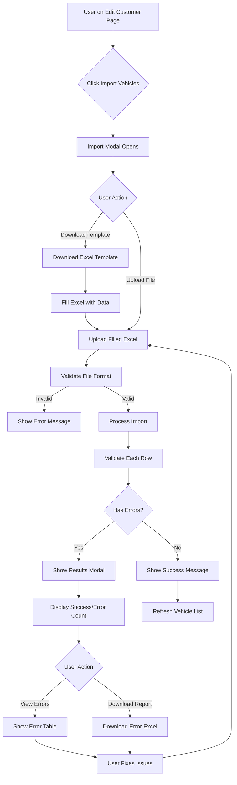

# Vehicle Import from Excel - Architecture Document

## Overview
This feature allows users to bulk import vehicle data from Excel files when editing customer records, particularly useful for company-type customers with multiple vehicles.

## Requirements Summary
- **Location**: Edit Customer page only (after customer exists)
- **Import Fields**: Make Name, Model Name, Year, Engine Capacity, Registration Number, Chassis Number
- **Template**: Downloadable Excel template with correct format
- **Error Handling**: Import valid rows, generate detailed error report for invalid ones
- **Lookup Method**: By Make/Model names (user-friendly)

---

## Technical Architecture

### 1. Dependencies
```xml
<PackageReference Include="EPPlus" Version="7.0.0" />
```
- EPPlus: Excel file processing library

### 2. Excel Template Structure

**File Name**: `Vehicle_Import_Template.xlsx`

| Column | Type | Required | Example | Validation |
|--------|------|----------|---------|------------|
| Make | Text | Yes | Toyota | Must exist in VehicleMakes table |
| Model | Text | Yes | Camry | Must exist in VehicleModels table for the Make |
| Year | Number | Yes | 2023 | Must exist in VehicleYears table |
| Engine Capacity | Text | No | 2.5L / 2500 CC | Must exist in EngineCapacities table |
| Registration Number | Text | No | ABC-1234 | Alphanumeric, unique per customer |
| Chassis Number | Text | No | JT123456789012345 | Alphanumeric, unique per customer |

**Template Features**:
- Header row with bold formatting
- Data validation hints in comments
- Sample data row for reference
- Bilingual headers (English / Arabic)

---

### 3. Backend Implementation

#### 3.1 Controller Actions

**File**: `Controllers/CustomerController.cs`

```csharp
// GET: Download vehicle import template
[HttpGet]
public IActionResult DownloadVehicleImportTemplate()

// POST: Import vehicles from Excel
[HttpPost]
public async Task<IActionResult> ImportVehiclesFromExcel(int customerId, IFormFile excelFile)

// GET: Get import results (for displaying errors)
[HttpGet]
public IActionResult GetImportResults(string sessionId)
```

#### 3.2 Data Models

**Import Result Model**:
```csharp
public class VehicleImportResult
{
    public int TotalRows { get; set; }
    public int SuccessCount { get; set; }
    public int ErrorCount { get; set; }
    public List<VehicleImportError> Errors { get; set; }
    public List<CustomerVehicle> ImportedVehicles { get; set; }
}

public class VehicleImportError
{
    public int RowNumber { get; set; }
    public string Make { get; set; }
    public string Model { get; set; }
    public string Year { get; set; }
    public string ErrorMessage { get; set; }
}
```

#### 3.3 Import Processing Logic

**Workflow**:
1. **File Validation**
   - Check file extension (.xlsx, .xls)
   - Check file size (max 5MB)
   - Check Excel structure (column headers)

2. **Data Extraction**
   - Read all rows from Excel
   - Skip empty rows
   - Parse each column

3. **Data Validation** (per row)
   - Required fields check
   - Make lookup in database (case-insensitive)
   - Model lookup for the specific Make
   - Year lookup in database
   - Engine Capacity lookup (optional)
   - Registration Number format and uniqueness
   - Chassis Number format and uniqueness

4. **Database Operations**
   - For valid rows: Create CustomerVehicle entities
   - Batch insert to database
   - Track inserted records

5. **Error Reporting**
   - Collect all validation errors
   - Return detailed error report
   - Store in session/temp storage for download

---

### 4. Frontend Implementation

#### 4.1 UI Components

**Location**: `Views/Customer/EditCustomer.cshtml`

**Components**:
1. **Import Button**: In vehicle section header
2. **Import Modal**: 
   - File upload input
   - Template download link
   - Instructions
   - Progress indicator
3. **Results Modal**:
   - Success count
   - Error count
   - Error details table
   - Download error report button

#### 4.2 JavaScript Functions

**File**: `wwwroot/js/vehicle-import.js`

```javascript
// Show import modal
function showVehicleImportModal()

// Handle file selection
function handleImportFileSelection(fileInput)

// Submit import file
function submitVehicleImport(customerId, file)

// Show import results
function showImportResults(result)

// Download error report
function downloadErrorReport(sessionId)
```

---

### 5. User Experience Flow



---

### 6. Validation Rules

#### 6.1 Make Validation
- **Rule**: Must exist in `VehicleMakes` table
- **Lookup**: Case-insensitive match on `MakeName` or `MakeNameAr`
- **Error**: "Make '{value}' not found in system"

#### 6.2 Model Validation
- **Rule**: Must exist in `VehicleModels` table for the matched Make
- **Lookup**: Case-insensitive match on `ModelName` or `ModelNameAr` where `VehicleMakeId` = matched Make's ID
- **Error**: "Model '{value}' not found for Make '{make}'"

#### 6.3 Year Validation
- **Rule**: Must exist in `VehicleYears` table
- **Lookup**: Exact match on `Year` field
- **Error**: "Year '{value}' not found in system"

#### 6.4 Engine Capacity Validation (Optional)
- **Rule**: If provided, must exist in `EngineCapacities` table
- **Lookup**: Match on `Capacity` value or `DisplayName`
- **Error**: "Engine capacity '{value}' not found in system"

#### 6.5 Registration Number Validation
- **Rule**: 
  - Max length: 50 characters
  - Unique within customer's vehicles
- **Error**: "Registration number already exists for this customer"

#### 6.6 Chassis Number Validation
- **Rule**:
  - Max length: 50 characters
  - Unique within customer's vehicles
- **Error**: "Chassis number already exists for this customer"

---

### 7. Security Considerations

1. **File Upload Security**:
   - Validate file extension
   - Check file size limit (5MB)
   - Scan for malicious content
   - Use anti-forgery token

2. **Authorization**:
   - Verify user is authenticated
   - Check user has permission to edit customer
   - Validate customerId belongs to user's scope

3. **Data Integrity**:
   - Use database transactions
   - Rollback on critical errors
   - Prevent SQL injection (use EF Core)

---

### 8. Error Handling

#### 8.1 Error Categories

| Category | Example | Action |
|----------|---------|--------|
| File Error | Invalid format, corrupted file | Reject entire import |
| Structure Error | Missing columns, wrong order | Reject entire import |
| Data Error | Invalid make/model | Skip row, continue import |
| Database Error | Connection failure | Rollback, show error |

#### 8.2 Error Report Format

**Excel File**: `Import_Errors_{timestamp}.xlsx`

| Row | Make | Model | Year | Error Message |
|-----|------|-------|------|---------------|
| 5 | Toyata | Camry | 2023 | Make 'Toyata' not found (did you mean 'Toyota'?) |
| 8 | Toyota | Camri | 2023 | Model 'Camri' not found for Make 'Toyota' |

---

### 9. Performance Considerations

1. **Batch Size**: Process in batches of 100 rows
2. **Memory Management**: Stream large files instead of loading entirely
3. **Database Queries**: 
   - Cache Make/Model/Year/Capacity lookups
   - Use single query to fetch all reference data
4. **Progress Indicator**: Show real-time progress for large imports

---

### 10. Localization Support

**Bilingual Features**:
- Template headers in both languages
- Error messages in both languages
- UI labels in both languages
- Success/failure messages in both languages

**Language Detection**:
- Use session language preference
- Default to English if not set

---

### 11. Testing Strategy

#### 11.1 Unit Tests
- Validate Excel parsing
- Test Make/Model lookup logic
- Test error message generation
- Test validation rules

#### 11.2 Integration Tests
- Import with all valid data
- Import with all invalid data
- Import with mixed valid/invalid data
- Import with duplicate registration numbers
- Import with missing optional fields

#### 11.3 Edge Cases
- Empty Excel file
- Excel with only headers
- Excel with special characters
- Excel with very long text
- Concurrent imports by same user

---

### 12. Future Enhancements

1. **Bulk Update**: Allow updating existing vehicles via import
2. **Delete Flag**: Support deleting vehicles via import
3. **Async Processing**: For very large files (>1000 rows)
4. **Import History**: Track all imports with audit log
5. **Template Customization**: Allow admin to customize template
6. **Smart Suggestions**: Suggest similar Make/Model names on errors
7. **Preview Mode**: Show data before actual import
8. **Rollback Feature**: Undo last import

---

## Implementation Priority

### Phase 1 (MVP)
✅ Template download
✅ Basic import functionality
✅ Lookup by Make/Model names
✅ Basic error reporting
✅ UI integration in Edit Customer page

### Phase 2 (Enhanced)
- Error report Excel download
- Progress indicator for large files
- Better error messages with suggestions
- Import history tracking

### Phase 3 (Advanced)
- Async processing
- Bulk update support
- Preview before import
- Rollback functionality

---

## Implementation Files

| File | Purpose |
|------|---------|
| `Controllers/CustomerController.cs` | Import/Template actions |
| `Views/Customer/EditCustomer.cshtml` | UI components |
| `wwwroot/js/vehicle-import.js` | Import functionality |
| `wwwroot/templates/Vehicle_Import_Template.xlsx` | Template file |
| `Models/VehicleImportResult.cs` | Import result models |

---

## Conclusion

This architecture provides a robust, user-friendly vehicle import feature that:
- Simplifies bulk vehicle data entry
- Provides clear error reporting
- Maintains data integrity
- Supports bilingual operation
- Scales for future enhancements